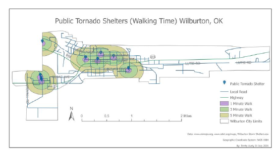

## Portfolio

### Maps
-[Child Abuse and Neglect - Oklahoma]

-[Wilburton, Oklahoma Storm Shelter Walkshed]

### Projects

- [Child Abuse and Neglect by Oklahoma County](https://github.com/trinitylively/TrinityLively/blob/0b4e1cab3c3bece81fc29461f9c1ce4c962df59d/pdf/Abundance%20of%20Medical%20Marijuana%20Dispensaries%20and%20Grows%20in%20Pittsburg%20County%5EJ%20Ok.pdf)

- [Abundance of Medical Marijuana Dispensaries and Grow Locations in Pittsburg County, Oklahoma](https://github.com/trinitylively/TrinityLively/blob/9d58eecbfbdfeb2d158f1095656c509f29824e7d/pdf/Abundance%20of%20Medical%20Marijuana%20Dispensaries%20and%20Grows%20in%20Pittsburg%20County%5EJ%20Ok.pdf)

- [Walkshed Analysis of Public Storm Shelters in Wilburton, Oklahoma](https://github.com/trinitylively/TrinityLively/blob/dfea8c598f3f9d3316fa687e0e976082b03b96e1/pdf/StormShelter%20Report.pdf)

- [Population Density - Pittsburg County, Oklahoma](https://arcg.is/1f1mq)

- [Guam Hiking Story Map](https://arcg.is/1CSTSu)

- [Welcome to Italy! Story Map](https://arcg.is/1PCSKm)

